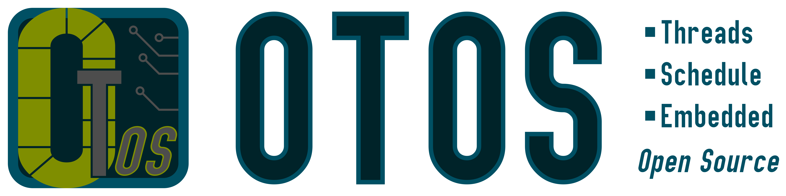

# OTOS


Bear bones realtime operating system for embedded systems. Focus lies on KISS (**K**eep-**I**t-**S**uper-**S**imple).

> Read the [&rarrb; Getting Started](#getting-started) when you want to use the OS in your project.

## Software Framework


> Supported Microcontrollers:
- STM<sup>&reg;</sub>

|Device | Core | FPU | Header |
|---|---|:---:|---|
|STM32F4xx|*ARM* Cortex M4<sup>&reg;</sub>|:x:|`arm_cm4_nofpu.h`|
|STM32L0xx|*ARM* Cortex M0+<sup>&reg;</sub>|:x:|`arm_cm0plus_nofpu.h`|

- Atmel<sup>&reg;</sub>

|Device | Core | FPU | Header |
|---|---|:---:|---|
|-|||

## Branches
|Name|Status|Description|
|---|---|---|
|**main**|`active`| Main branch for working on **releases**|
|**dev**|`active`| Main branch for **developing**|

## Getting Started
You want to use the *OTOS* operating system in your project? Awesome! :sunglasses:

Here are the main steps to get up and running:

### Initialize the Kernel
The kernel is automatically initialized when the *kernel* object is created:
```cpp
// Create the kernel object
OTOS::Kernel OS;
```
- Only create the kernel **once**! (The kernel class is not yet implemented as a *singleton*...)
- The kernel should be created in your **main** function.

### Schedule the Threads
Each thread handles **one** task. You can bundle multiple actions in one task, or use separate tasks for each action.
The tasks are scheduled using their *function name*:
```cpp
// Schedule task with the function name MyTask
OS.scheduleTask(&MyTask, OTOS::Check::Stack(256), OTOS:PrioNormal);
```
- You have to schedule the thread in the file where your *kernel* object is created.
- The task can be defined in a separate file.

### Control within Thread/Task
The OS **does not** implement a *preemptive* scheduling (yet). So your scheduled task has
to periodically yield its execution and tell the OS that another task can be executed.
```cpp
// Tell the OS that it can give the control to another task
OTOS::Thread::yield();
```

### Start Executing the Threads
Once all threads are scheduled, you can start the kernel execution with:
```cpp
// Start the kernel and execute the threads
OS.start();
```
- This starts an *infinite* loop inside the kernel, which switches the context of each thread according to the schedule.
